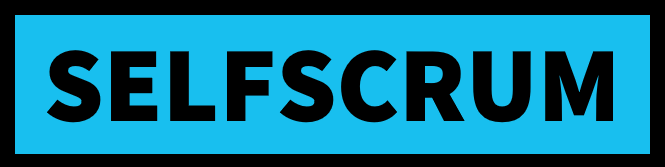

# Einleitung

SELFSCRUM ist ein Open Source-Betriebssystem für offenes demokratisches Lernen.

Was heißt das? Wir glauben, dass wir die vereinte Anstrengung vieler brauchen, um kindliches und jugendliches Lernen auf ein neues Niveau zu heben, das der heutigen Zeit und den zukünftigen großen Herausforderungen gerecht wird. Wir sind der festen Überzeugung, dass Schule und Lernen komplett neu gedacht werden muss.

Die gute Nachricht ist, dass es bereits viele gute Ansätze gibt. Sie kommen aus verschiedensten Richtungen. Sei es aus klassichen Schulen, wo viele motivierte Menschen mit guten Ideen versuchen, ein erstarrtes System am Leben zu halten, sei es aus der freien Wirtschaft, wo Wissen und Lernen heute überlebensnotwendige Eigenschaften sind und auch aus der weltweiten Open Source Gemeinschaft, in der sehr viel ohne kommerzielles Interesse geteilt und entwickelt wird. Und auch die gesellschaftlichen Kräfte der aktuellen Nachhaltigkeitsbewegungen, die gelernt haben, sich auf moderne Art und Weise zu organiseren, um ihren Anliegen eine Stimme zu geben, sind ein wichtiger Impulsgeber.

Die hauptsächliche Basis von SELFSCRUM ist jedoch die konzeptionelle und praktische Erfahrung, die wir beim Aufbau der Freien Schule Ostfriesland gemacht haben. Wir wollen das teilen und weiterentwickeln, was wir gelernt haben, damit möglichst viele den Mut finden, einen ähnlichen Weg zu gehen wie wir. Aber auch wir profitieren von der weiteren Öffnung, weil so viele neue Inspirationen zu uns zurück kehren

Damit unser Projekt erfolgreich sein kann, benötigen wir Klarheit in diesen Bereichen

1. Werte
2. Lernkonzept
3. Organisation
4. Betrieb
5. Community

Nach diesen Leitpunkten werden wir die folgenden Abschnitte untergliedern.

Diese Dokumentation ist ein Arbeitsstand, in das die aktuellen Überlegungen der Community von selfscrum.org eingeflossen sind. Wer will, kann das Konzept oder Teile davon einsetzen und uns Feedback dazu geben. In künftigen Releases werden wir dann ein gesamtheitliches Verfahren haben, dass es uns erlaubt, neue Lernräume mit wenig Aufwand zu gründen oder aus herkömmlichen Systemen umzuwandeln.

