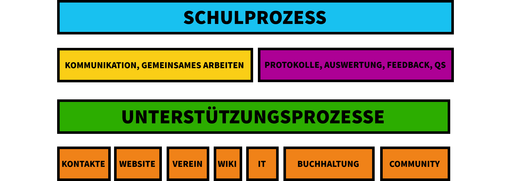

# Betrieb

Wir wollen künftig Systeme und Prozesse als Service für Initiativen und Schulen anbieten, die das notwendige Know-How nicht selber aufbauen können. Die Systeme -so weit sie Open Source sind- und die Infrastrukturkonzepte unterliegen wie die anderen Konzepte der Open Source. Sofern Arbeitsleistungen übernommen werden sollen, können wir dies zu kostengünstigen Sätzen anbieten, da wir auf automatisierte und standardisierte Prozesse setzen.

