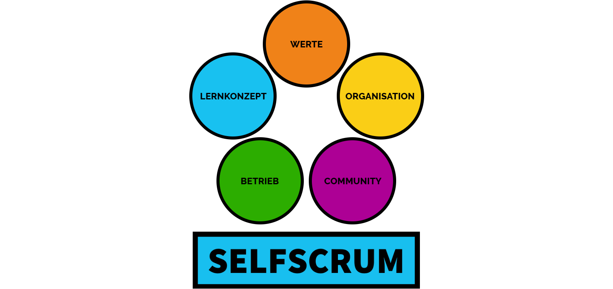

# Die SELFSCRUM-Dimensionen

Für SELFSCRUM haben wir verschiedene Dimensionen definiert, die wir zu klären haben, um unser Modell erfolreich einzusetzen.

## Werte - Leitlinien unserer Entwicklung

Welche "Verfassung" geben wir unserem Vorhaben? Welche Orientierung wollen wir nutzen, um in Zweifelsfragen gut entscheiden zu können? Wir haben uns bei der Schulgründung viel um die Grundwerte Gedanken gemacht. Diese Grundwerte sind auch für SELFSCRUM weiterhin gültig und relevant. Wir haben sie hier angepasst für die Gestaltung des Entwicklungsprozesses.

Mehr dazu unter "[Unsere Grundwerte](./values.md)".

## Lernkonzept - das Basiskonzept für die Schulentwicklung

Das Lernkonzept ist ein wichtiger Baustein bei SELFSCRUM. In unserer Schule hieß es noch Schulkonzept und begann als Kopie einer anderen Schule, die wir "irgendwie" gut fanden. Es hat nahezu ein halbes Jahr intensiver Workshops und Diskussionen gedauert, bis wir uns von dieser Kopiervorlage lösen konnten und ein eigenes Konzept auf die Beine gestellt haben. Uns hat das gezeigt, dass bei solchen wichtigen Vorhaben die eigene Auseinansersetzung, das eigene Lernen nicht abgekürzt oder übersprungen werden kann. Daher wollen wir das SELFSCRUM-Konzept auf möglichst breiter Basis aufstellen, so dass viele daran mitarbeiten können und vielleicht schon vorbereitet in die eigene Gründungsphase starten.

Eine weitere wesentliche Funktion des Lernkonzepts ist der Nachweis der Gesetzeskonformität des Schulvorhabens. Die Schulbehörden der Länder verlangen in der Regel eine schriftliche Ausarbeitung, wie die Andersartigkeit gleichwertig zum Schulgesetz gestaltet werden wird. Das mag manchmal widersprüchlich oder sogar feindlich anmuten. Uns hat jedoch die Kritik der Behörden auch geholfen, besser zu werden und Lücken in unserem Konzept zu schließen. Wir haben im Verlauf der Zeit bemerkt, dass immer mehr Konzepte von Gründungsinitiativen eingereicht werden und die Behörden immer kompetenter darauf reagieren. Von daher kann es nicht schaden, mit der Zeit einen Standard-Konzeptions-Kern herauszubilden, der nicht jedes Mal individuell mühselig verhandelt werden muss.

Das Lernkonzept setzt in seiner ersten Version stark auf projektbasiertes Lernen, da wir dieses Konzept in unserer kommenden Oberschule verstärkt einsetzen wollen. Natürlich sind hier auch andere Lernformen denkbar. Wir freuen uns über eine konstruktive Erarbeitung in der Community. Ein großer Teil dieser Dokumentation beschäftigt sich mit dem Lernkonzept.

## Organisation - Strukturen, Rollen und Prozesse für den Alltag

## Betrieb - Bereitstellung von Ressourcen und Kompetenzen

## Community - Methodische Entwicklung als Open Source

