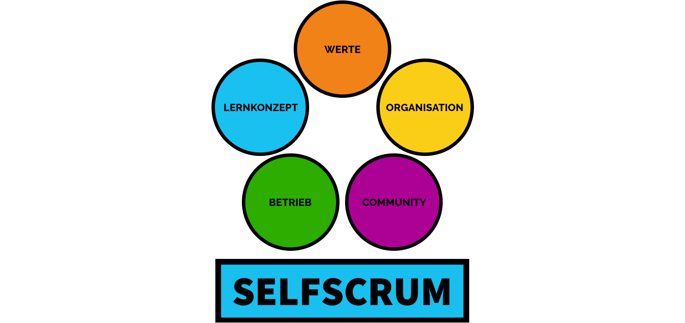

# Die SELFSCRUM-Dimensionen

Für SELFSCRUM haben wir verschiedene Dimensionen definiert, die wir zu klären haben, um unser Modell erfolreich einzusetzen.

## Werte - Leitlinien unserer Entwicklung

Welche "Verfassung" geben wir unserem Vorhaben? Welche Orientierung wollen wir nutzen, um in Zweifelsfragen gut entscheiden zu können? Wir haben uns bei der Schulgründung viel um die Grundwerte Gedanken gemacht. Diese Grundwerte sind auch für SELFSCRUM weiterhin gültig und relevant. Wir haben sie hier angepasst für die Gestaltung des Entwicklungsprozesses.

Mehr dazu unter "[Unsere Grundwerte](./values.md)".

## Lernkonzept - das Basiskonzept für die Schulentwicklung

Das Lernkonzept ist ein wichtiger Baustein bei SELFSCRUM. In unserer Schule hieß es noch Schulkonzept und begann als Kopie einer anderen Schule, die wir "irgendwie" gut fanden. Es hat nahezu ein halbes Jahr intensiver Workshops und Diskussionen gedauert, bis wir uns von dieser Kopiervorlage lösen konnten und ein eigenes Konzept auf die Beine gestellt haben. Uns hat das gezeigt, dass bei solchen wichtigen Vorhaben die eigene Auseinansersetzung, das eigene Lernen nicht abgekürzt oder übersprungen werden kann. Daher wollen wir das SELFSCRUM-Konzept auf möglichst breiter Basis aufstellen, so dass viele daran mitarbeiten können und vielleicht schon vorbereitet in die eigene Gründungsphase starten.

Eine weitere wesentliche Funktion des Lernkonzepts ist der Nachweis der Gesetzeskonformität des Schulvorhabens. Die Schulbehörden der Länder verlangen in der Regel eine schriftliche Ausarbeitung, wie die Andersartigkeit gleichwertig zum Schulgesetz gestaltet werden wird. Das mag manchmal widersprüchlich oder sogar feindlich anmuten. Uns hat jedoch die Kritik der Behörden auch geholfen, besser zu werden und Lücken in unserem Konzept zu schließen. Wir haben im Verlauf der Zeit bemerkt, dass immer mehr Konzepte von Gründungsinitiativen eingereicht werden und die Behörden immer kompetenter darauf reagieren. Von daher kann es nicht schaden, mit der Zeit einen Standard-Konzeptions-Kern herauszubilden, der nicht jedes Mal individuell mühselig verhandelt werden muss.

Das [Lernkonzept](../model/model.md) setzt in seiner ersten Version stark auf projektbasiertes Lernen, da wir dieses Konzept in unserer kommenden Oberschule verstärkt einsetzen wollen. Natürlich sind hier auch andere Lernformen denkbar. Wir freuen uns über eine konstruktive Erarbeitung in der Community. Ein großer Teil dieser Dokumentation beschäftigt sich mit dem Lernkonzept.

## Organisation - Strukturen, Rollen und Prozesse für den Alltag

Ein Lernkonzept ist erstmal Theorie - das haben wir am ersten Tag unserer neuen Schule auch erfahren. Vieles läuft in der Praxis ganz anders, als es ursprünglich vorgesehen war. Da hilft es sehr, wenn die Organisation klar aufgestellt ist und genau zwischen Regelbetrieb und Ausnahmen unterscheiden kann. Das Ziel ist, den Regelbetrieb so "automatisch" wie möglich zu organisieren, damit den Lernbegleitern viel Zeit für die Schüler*innen bleibt und Ausnahmen so behandelt werden, dass sie zu neuen Einsichten und verbesserten Abläufen führen-

Hier ist zugegebenermaßen noch viel Luft nach oben. Wir haben an der freien Schule Ostfriesland schon einige Verwaltungsprozesse schlank und digital aufgesetzt, es kann jedoch noch vieles verbessert werden. Hier schauen wir besonders aufmerksam auf "Best Practices" von anderen Stellen wie zum Beispiel Unternehmen und anderen selbstorganisierten Entwicklungsprozessen. 

## Betrieb - Bereitstellung von Ressourcen und Kompetenzen

Wie "läuft" denn so eine Schule? Sicher mit vielen engagierten Menschen und viel Improvisationstalent. Die Anfangs-Euphorie verschwindet oft in aufreibenden Routine-Arbeiten, die nicht gut organisiert sind. Sei es die Protokollierung der Lernergebnisse, die datenschutzkonforme Verwaltung der Schülerinformationen oder auch die Buchführung und die Spendenorganisation.

Und natürlich hängt hier sehr viel von einer geschickten Wahl der IT-Systeme ab. Wir können es als Segen empfinden, dass wir mit den freien Lernkonzepten meistens nicht in die Standard-Schul-Software hineinpassen! So müssen wir zwar mehr selber in dieses Thema investieren, bekommen aber eine schlanke Unterstützung nach Maß. Wo immer es geht, wollen wir mit Open Source Technologien arbeiten, um die Abhängigkeit von kommerziellen Anbietern so klein wie möglich zu halten. Nicht nur aus Kostengründen, sondern auch, weil wir uns selber vorbehalten, zu entscheiden, was gut für uns ist und wer mit unseren Daten arbeiten darf.

[Hier](../betrieb/betrieb.md) kann natürlich noch viel aufgebaut werden und wir freuen uns auf die Techies in der Community!

## Community - Methodische Entwicklung als Open Source

SELFSCRUM ist vor allem aus diesem Grund entstanden: **Wir wollen offene, freie Konzepte und Systeme für jeden, der sie nutzen will.** Das ist für ein entscheidender Faktor für die freie Entwickung. Zu schnell gerät man in Abhängigkeiten von kommerziellen Interessen, so gut wie sie vielleicht auch ursprünglich gemeint gewesen sind. Wer auch immer für Konzepte und Systeme Geld verlangt, wird früher oder später etwas tun müssen, um sich vom Markt abzuheben. Das heißt entweder, Geld zu inverstieren, was dann über Gebühren oder Lizenzen mit Gewinn wieder zurückkommen muss, oder es bedeutet die Erfindung besonderer Methoden und Techniken, die dann "geheim" gehalten werden müssen, um sich Nachahmer und Trittbrettfahrer vom Leib zu halten. Auch hier ist eine Barriere zu den Nutzer*n dieser Erfindungen vorhanden, die dann wiederum monetarisiert wird oder zumindest über Vertraulichkeitsvereinbarungen und Vertragsstrafen die weitere Verbreitung von guten Lösungen verhindert. Daher setzen wir wo immer es geht auf Open Source. Was ursprünglich als Konzept zur Emanzipation von IT Herstellern begann, hat inzwischen viele Lebensbereiche erreicht und zeigt dort seine positive Wirkung. 

Mehr dazu unter "[Community](../community/community.md)".
