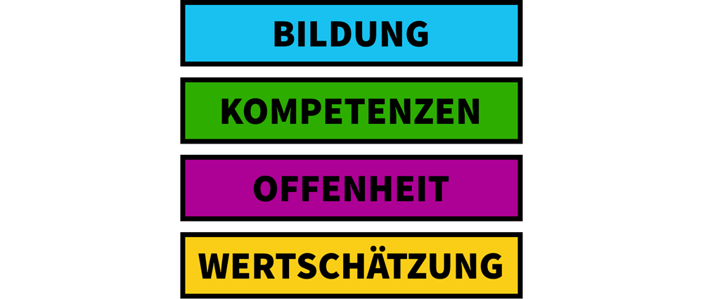

# Unsere Grundwerte

## Wertschätzung - Jede\*r wird wahrgenommen

Wertschätzung bedeutet für uns, eine Atmosphäre zu schaffen, in der sich jedes Mitglied der Lerngemeinschaft wahrgenommen und angenommen fühlen kann – als Individuum mit all seinen Eigenheiten und gleichzeitig zugehörig zur Gruppe. Die individuellen Bedürfnisse von Erwachsenen und Kindern werden als gleichwertig angesehen und geachtet.

Lernen geschieht leichter ohne Angst und auf der Basis vertrauensvoller Beziehungen. Daher ist es uns wichtig, spontanen Lernprozessen Raum zu geben und vielfältige Kommunikation unter allen beteiligten Personen zu ermöglichen.

Dies ist auch für die Gestaltung von Organisationen von besonderer Wichtigkeit. Wie schnell schleicht sich "Der Prozess muss erfüllt sein" in die Beziehungen und wie oft ersetzt ein Formular einen Dialog? Wirt setzen uns zum Ziel, die menschlichen Kapazitäten so viel wie es geht zum Arbeiten mit Menschen zu nutzen und alles, was sich automatisieren lässt, von Maschinen erledigen zu lassen.

## Offenheit - Jede\*r verhält sich ehrlich, klar, authentisch

Offenheit ist eine Grundhaltung, die wir fördern. Ehrlichkeit, Klarheit und Authentizität sind uns im Umgang miteinander wichtig.

Offenes Lernen bedeutet für uns dass Lernende den Lerninhalt, Raum, Zeit, Lernpartner, sowie den für sie passenden Lernweg selbst wählen können. Für Lehrende bedeutet methodische und inhaltliche Offenheit, die Lernenden individuell auf ihrem jeweiligen Lernweg zu begleiten.

Damit fordert der Lern-Alltag eine persönliche Offenheit aller Beteiligten. Das bedeutet, dass jeder die Verantwortung für seine wahren Bedürfnisse und Ansichten übernimmt und den Raum findet, sie klar und authentisch zu vertreten.

Uns ist es wichtig, dass ein Lernort sich seiner Umgebung öffnet, Impulse von außen aufnimmt und selber Erfahrungen weiter gibt. Wir wollen uns vernetzen und so möglichst viele Dimensionen der Welt für die Lernenden erfahrbar machen.

Offenheit heißt für uns auch, dass wir die Entwicklung von Lernprozessen als Teil der gesellschaftlichen Öffentlichkeit sehen. Jeder sollte jederzeit Zugriff auf die Entwicklungsprozesse und die Akteure haben und selber Teil dieser Entwicklungsgemeinschaft werden können. Das umfasst für uns auch alle methodischen Grundlagen und Arbeitsergebnisse, die wir für Dritte zur Verfügung stellen wollen. Ein seit Jahren bewährter Mechanismus ist dafür Open Source.

## Kompetenzen - Jede\*r entwickelt sich nach seinen Fähigkeiten

Wir ermöglichen jedem individuelle Entfaltung, um den eigenen Platz in der Gesellschaft würdig und selbstbestimmt einnehmen zu können.

Dazu fordern wir jedes Mitglied der Lerngemeinschaft auf, sich nach seinen Möglichkeiten zu bilden. Zu den Basisfähigkeiten, die wir heute mit „Lernen“ verbinden, zählen wir neben der Fähigkeit zum verantwortlichen Umgang mit den Grundwerden auch Zuversicht, Selbstbewusstsein, denken und kommunizieren können, Führung übernehmen können und Verantwortung für die Gestaltung des eigenen Lebens übernehmen können.

## Bildung - Jede\*r kann relevant handeln

Wir glauben, dass Bildung die Fähigkeit ist, in unserer Welt relevant zu handeln und sich dazu mit anderen zu verbinden. Dazu ist für uns vor allem Authentizität des Lernens ein zentraler Wert. Bildung ist dann authentisch, wenn sie direkt auf Erfahrungen der Welt zugreift und Lernprozesse direkt in der Welt stattfinden statt in künstlichen Lernumgebungen.

Wir als Entwickler des Lernraums haben die Aufgabe, die Rahmenbedingungen dafür zu gestalten. Wir stellen den Raum zur Verfügung, in dem das natürliche Lernen stattfinden kann. Dieser Raum ist weitläufig gestaltet, damit die Freiheit nicht verloren geht. Er wird nur durch unsere Grundwerte begrenzt und wir gestalten ihn anhand unserer Leitlinien.

