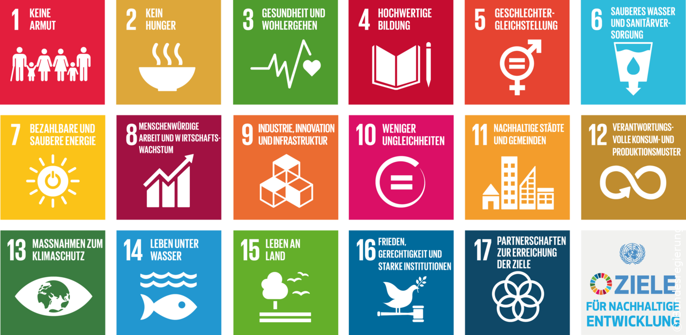
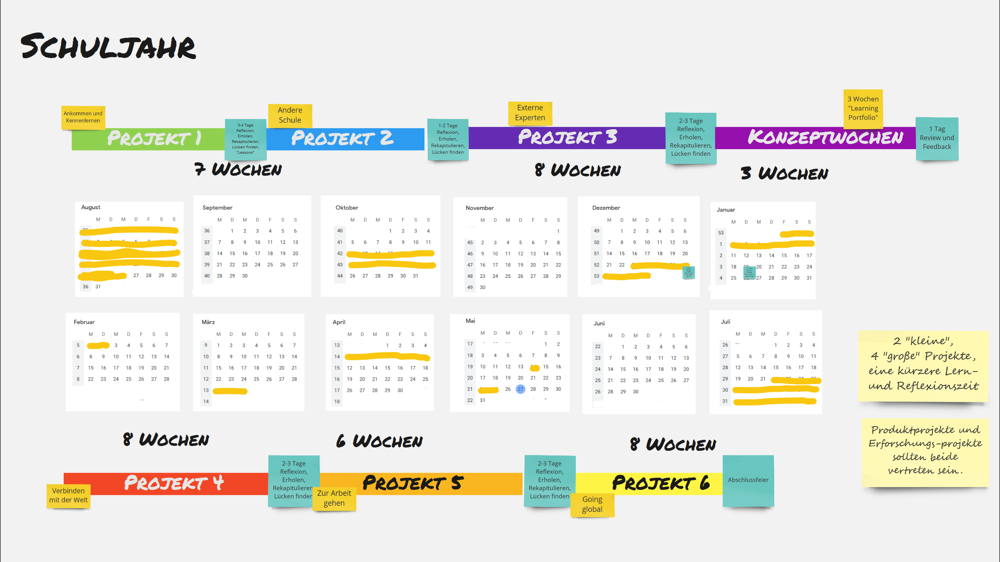

# Das SELFSCRUM Lernkonzept

Das SELFSCRUM Lernmodell ist vor allem ein offenes Rahmenwerk. Dieser Rahmen wird durch zwei Dimensionen aufgespannt:

1. Wir glauben nicht an künstlich hergestellte "Lernwelten" - es gibt für Schüler\* genug Gelegenheiten, selbstständig in der echten Welt zu lernen
2. Wir glauben nicht an ein Standardcurriculum - es gibt genug Herausforderungen, die unsere moderne Gesellschaft hervorgerufen hat und die wir und vor allem unsere Kinder und Enkel zu lösen haben.

Je nach Ziel der Schule kann sie ein individuelles Lernmodell nun innerhalb dieses Rahmens eingliedern. Als erstes unterstütztes Beispiel werden wir hier in diesem Leitfaden das Projektbasierte Lernen betrachten. Es ist ein gut abgeschlossenes, bekanntes Modell, dass sich einfach in den Alltag integrieren lässt und den Lernenden viele inhaltliche Freiheiten gibt. Die Methodentreue im Projekt ist hingegen wichtig - hier ist es gut, eine gewisse Stabilität zu lehren und einzuüben, damit die Vorhaben auch gelingen.

## Inhalte

Bei aller Offenheit brauchen wird jedoch für das projektbasierte Lernen auch eine inhaltliche Fokussierung, die nicht zu eng gefasst ist, damit echtes Lernen entstehen kann und nicht zu weit, damit die Lernprozesse sich nicht in Beliebigkeit verlieren. Wir haben daher die nächsten Lernzyklen auf die [17 globalen Ziele](https://17ziele.de/) für nachhaltige Entwicklung ausgerichtet.

Damit haben wir genügend individuelle Einstiegspunkte und die Möglichkeit, "echte" Forschungsfragen zu generieren, die für die Lernprozesse so entscheidend sind.

## Projekt-Rahmen

Eine passende pädagogische Fundierung ist für uns das Project-Based Learning \(PBL\), aus wissenschaftlichen Forschungen in den USA Ende letzten Jahrhunderts entstanden. Ich habe erst später herausgefunden, dass PBL in Deutschland eher Problembasiertes Lernen bedeutet - wieso ist in Deutschland eigentlich immer alles ein „Problem“?.

„Projekte machen wir auch“, denkt man sich vielleicht bei diesem Begriff. Projektbasiertes Lernen ist jedoch ein ganz anderes Konzept als die schablonenartig hergestellten Projektwochen, die wir heute in vielen Schulen antreffen.

## Takt

Da wir PBL als Basiskonzept einrichten wollen, brauchen wir einen Takt, der uns mit Projekten durch das Lern-Jahr bringt, das ja meistens durch die Schulferien gegliedert wird. Keine natürliche, aber eine pragmatische Grenze, die vielen Familien ihre Jahresplanung erleichert, die aber selbstverständlich kein Naturgesetz ist.

Wir nutzen diese Feriengrenzen meist auch als Projektgrenzen. Je nach Alter und Erfahrung der Lernenden und dem Umfang des geplanten Projekts können natürlich auch längere Projekte geplant werden. Kleinere Zeiträume können auch gelegentlich genutzt werden, um Konzeptphasen unterzubringen, in denen intensiv an Themen gearbeitet werden kann, die sich nicht gut in ein Projekt eingliedern lassen.

Ein Projekt läuft dann immer im selben Zyklus ab. Das erste Projekt ist verkürzt und hat das Ziel, zunächst die Projektmechanik einzuüben.

Zusätzlich zur Projektarbeit soll noch weitere Zeit zur Verfügung stehen, um nötige Basiskonzepte einzuüben oder an individuellen Interessen weiter zu forschen. Der Wochenplan sieht dies entsprechend vor. Im folgenden ein Entwurf.

## Stakeholder

"Es braucht ein Dorf, um ein Kind zu erziehen" - dieses afrikanische Sprichwort ist wahrer denn je. Nur die Rollen und die geografische Verteilung der Dorfbewohner haben sich eventuell geändert.

Wir betrachten in unserem Lernmodell

* Die \(jungen\) Lernenden selbst
* Lehrende innerhalb der Organisation
* Lehrende außerhalb der Organisation
* Eltern
* Andere Lernorganisationen
* Die SELFSCRUM Community
* Die Normenverantwortlichen
* Zunächst unbeteiligte Dritte
* Promoter und Sponsoren

Wir wissen, dass die "Lernenden" nicht die einzigen sind, die Unterstützung brauchen! Vor allem die Eltern als familiärer Ankerpunkt spielen eine Schlüsselrolle in der Gestaltung von Lernerfahrungen für junge Menschen. Wir wissen auch, dass auch vor allem heute professionell Lehrende viel Kraft, Mut und Ausdauer brauchen, die bisherigen Denkmuster zu überwinden und sich auf neue Ideen und Vorgehensweisen einzulassen.

Daher sind im SELFSCRUM Lernmodell auch begleitende Schulungen, Workshops und Events für diese Gruppen vorgesehen.

Gerade in Deutschland sind die normativen Rahmenbedingungen sehr kompliziert. Durch unsere föderale Bildungsstruktur herrscht eine Kleinstaaterei, die jede private Bildungsinitiative, die überregional arbeiten will, stark fordert. Die strikte Schulpflicht trägt ebenfalls zu einer Verengung unserer Gestaltungsmöglichkeiten bei. Wir möchten daher lernen, besser mit diesen Rahmenbedingungen umzugehen, um alle Möglichkeiten kreativ auszuschöpfen und werden auch versuchen, auf diese Bedingungen im Sinne unserer Ideale einzuwirken. Letzteres ist jedoch eher ein Randaspekt der SELFSCRUM-Aktivitäten, da es mit EUDEC und BFAS bereits Vertretungen dieser Art gibt und wir uns eher auf die Gestaltung des Lernraums konzentrieren wollen.

Eine letzte wichtige Rolle sind diejenigen Menschen und Organisationen, die uns mit ihren Mitteln helfen können, mit unseren Ideen besser voranzukommen. Da das private Bildungswesen chronisch unterfinanziert ist, ist die positive Gestaltung dieser Beziehungen für jeden Lernanbieter ein wichtiges Überlebenskriterium. Hier wollen wir Erfahrungswissen zur Verfügung stellen, um den Start von neuen Initiativen zu erleichtern.

## Warnung vorab

\(Frei nach einem Hinweies bei den Agile Learning Centers\)

> Nichts von all dem wird so verlaufen, wie du es erwartest. Es wird laut sein, und es wird Farbe auf den Boden fallen, es wird in der ganzen Schule Verfolgungsjagden geben und Geschrei, wenn du um Konzentration bittest, und Streit darüber, wer an der Reihe ist, und Treffen, bei denen es sich anfühlt, als ob niemand aufpasst, und regnerische Nachmittage, an denen ihe euch alle gegenseitig unter die Haut geht. Lass dich von all dem nicht abschrecken. Denke daran, dass das Wachstum in Aufwärtsspiralen verläuft, dass das Schuljahr lang ist und dass das ganze Selbst, das du in die Schule mitbringst, gültig ist, auch wenn du dich frustriert oder überfordert fühlst. Du bist auf dieser Reise nicht allein - das Netzwerk ist voll von anderen, die sich mit den gleichen Fragen, Sorgen und Frustrationen herumgeschlagen haben. Scheue dich nicht, dich über die Community oder direkt bei den Initiatoren zu melden. Denke daran, dass dies ein lebendes Dokument ist. Erfinde neue Werkzeuge und Praktiken dort, wo sie gebraucht werden. Ändere Dinge, die nicht funktionieren. Höre darauf, was deine Mitmenschen brauchen. Sei agil.

